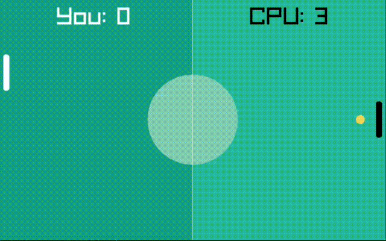

# 🏓 Pong Game



## 📝 Overview

This is a simple Pong game implemented in C++ using the Raylib library and Object-Oriented Programming (OOP) principles. It's a basic version of the classic arcade game where two players use paddles to hit a ball back and forth. But with a twist; The ball speeds up each time it collides with the paddle 😎  
And the speed is reset back when a goal is scored 

## ✨ Features
- Currently only a single player against a brutal CPU 😄  
- Soon, I may add the two player functionality as an option

## 🎮 Controls
- **Player (Left Paddle):**
  - Move Up: `Up Arrow`
  - Move Down: `Down Arrow`

## 📋 Requirements

- C++ compiler (e.g., g++)
- Raylib library

## 💻 Installation

1. **Clone the Repository:**
    ```sh
    git clone https://github.com/g-magdy/pong-game.git
    cd pong-game
    ```

2. **Install Raylib:**
    Follow the instructions on the [Raylib website](https://www.raylib.com/) to install Raylib for your operating system.

3. **Compile the Game:**
    ```sh
    make game
    ```

4. **Run the Game:**
    ```sh
    ./game
    ```

## 📁 Code Structure

- **main.cpp:** Contains the main game loop and initialization code.
- **Ball.h / Ball.cpp:** Defines the Ball class for the game ball.
- **Paddle.h / Paddle.cpp:** Defines the Paddle class for player paddles.
- **ComputerPaddle.h / ComputerPaddle.cpp:** Inherits from the paddle class and simulates a player -a hard one 😄-

## 🤝 Contributing

Currently, I am the only contributor to this project. However, if you have suggestions or improvements, feel free to fork the repository and create a pull request.

## 📄 License

This project is open source and available under the [MIT License](LICENSE).

Enjoy playing Pong!
